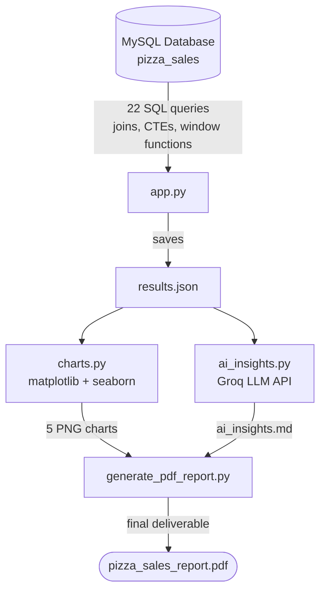
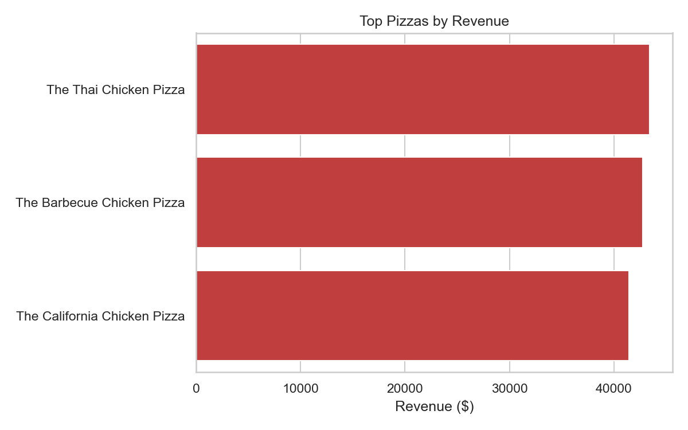
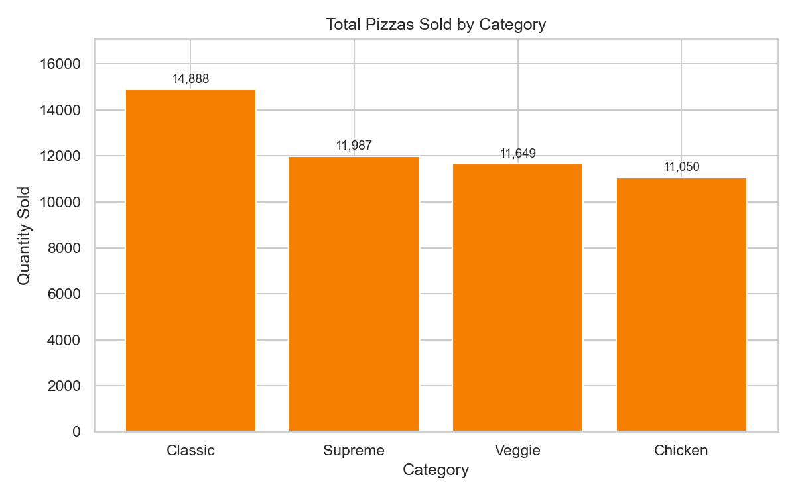
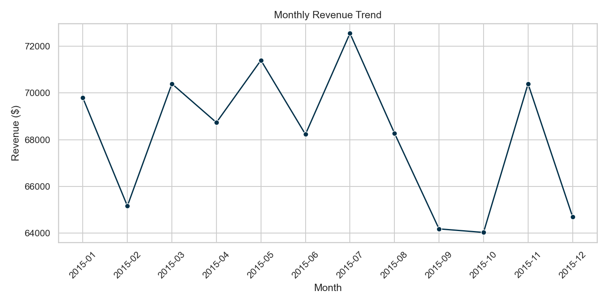
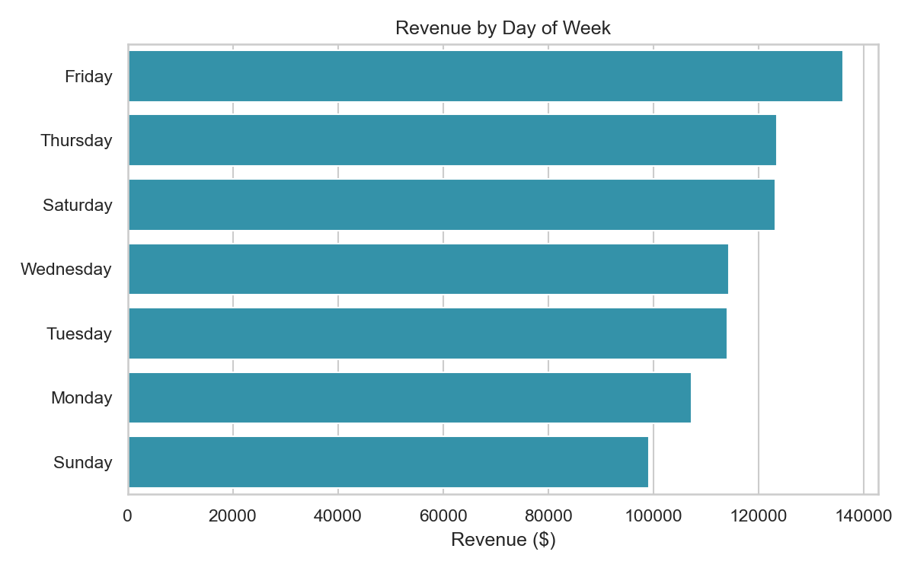
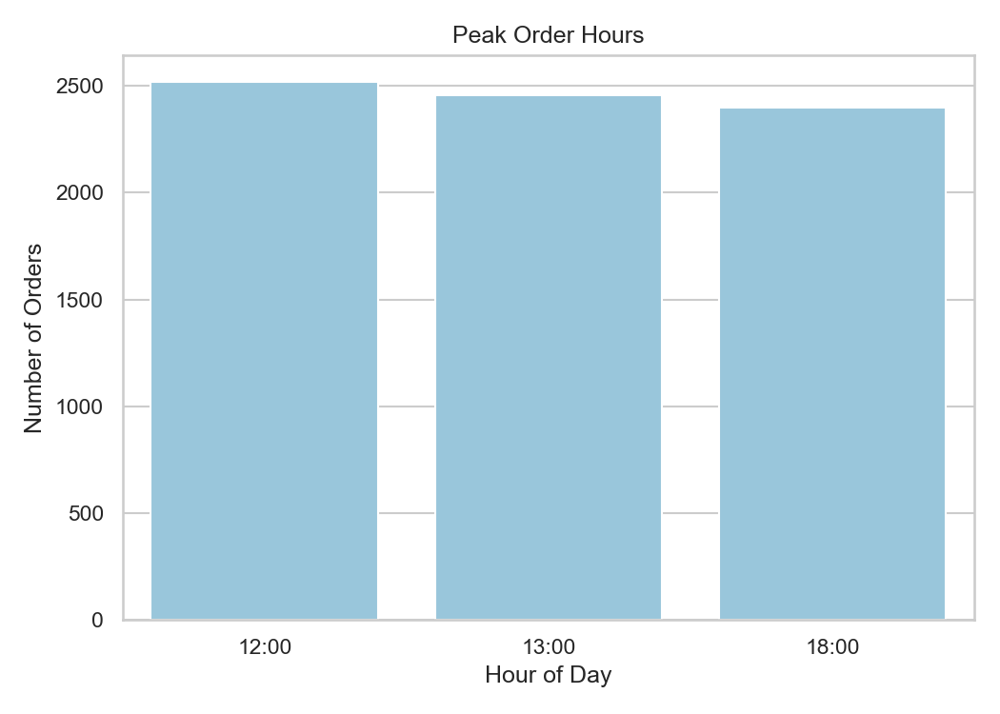

# 🍕 AI-Powered Pizza Sales Analytics

**SQL analytics pipeline that turns raw sales data into an automated, AI-written business report with charts.**

Instead of a manager having to read through raw numbers and figure out what they mean, this project turns MySQL sales data into a written business report automatically — the interpretation step happens in code, not in someone's head.

---

## 📌 Business Problem

A pizza restaurant chain has a year of order-level sales data sitting in a database, but no one is turning it into decisions. Leadership needs answers to questions like:

- Which pizzas and categories actually drive revenue?
- When are we busiest, and are we staffed for it?
- Is revenue growing or shrinking, and in which months?
- Which menu items are underperforming and should be reconsidered?

Answering these by hand every week doesn't scale. This project builds a repeatable pipeline that answers them automatically, end to end, every time it's run.

---

## ✅ How I Solved It

1. **SQL does the analytical heavy lifting.** 22 business-question queries (joins, CTEs, window functions like `LAG()` and `RANK() OVER (PARTITION BY ...)`) — including queries that use `ORDER BY ... LIMIT` to find the best/worst month, day, and pizza directly in the database, rather than searching for it in Python.
2. **Python automates the workflow.** A script runs every query, saves the results as structured JSON — no manual copy-pasting between steps.
3. **An LLM (Groq/Llama 3.3) interprets the numbers.** The AI receives the real, pre-sorted KPIs and writes an executive summary, insights, and specific recommendations tied to actual figures — not generic advice.
4. **Matplotlib/Seaborn visualizes the KPIs.** Five charts covering revenue, category performance, trend, weekday patterns, and peak hours.
5. **Everything is compiled into a single PDF report** — a shareable business document, not just terminal output.

---

## 🏗️ Architecture



**Why this design:** each script has exactly one job (run queries / make charts / get AI insights / assemble PDF), and adding a new SQL query to `queries.py` automatically flows into `results.json` and the AI-written report — no other code needs to change.

---

## 🧰 Tech Stack

| Layer | Tool |
|---|---|
| Database | MySQL |
| Query logic | SQL — joins, CTEs, window functions |
| Automation | Python (`mysql-connector-python`) |
| AI insights | Groq API (Llama 3.3 70B) |
| Charts | Matplotlib, Seaborn |
| Report output | ReportLab (PDF generation) |
| Secrets management | python-dotenv (`.env`, not committed) |

---

## 📂 Project Structure

```
Pizza-Sales-Ai-Analytics/
│
├── app.py                   # connects to MySQL, runs all queries, saves results.json
├── queries.py                # all 22 SQL business questions, in one place
├── charts.py                  # generates matplotlib/seaborn charts from results.json
├── ai_insights.py             # sends KPIs to Groq, saves ai_insights.md
├── generate_pdf_report.py     # combines charts + AI text into the final PDF
│
├── charts/                    # generated chart PNGs
├── results.json                # raw query output (generated)
├── ai_insights.md              # AI-written report (generated)
├── pizza_sales_report.pdf      # final deliverable (generated)
│
├── requirements.txt
├── .env                        # DB password + API key (not committed)
└── README.md
```

---

## 📊 Sample Output

**Top pizzas by revenue**


**Pizzas sold by category**


**Monthly revenue trend**


**Revenue by day of week**


**Peak order hours**


---

## 🧠 Sample AI-Generated Insight

> Total revenue reached $817,860.05 from 21,350 orders, with the strongest growth in November (+9.95%) and the sharpest decline in December (-8.09%). The Classic category contributes the highest share of revenue at 26.91%, while Large pizzas alone account for 45.89% of total revenue — suggesting upsell potential toward larger sizes. Friday is the strongest single day for revenue, and order volume peaks at 12pm, 1pm, and 6pm, pointing to clear staffing windows.

*(Full report generated fresh each run — see `ai_insights.md` and `pizza_sales_report.pdf`.)*

---

## 🔑 Key Design Decisions

- **SQL finds the "best/worst," not Python.** Queries like `peak_month` and `highest_growth_month` use `ORDER BY ... LIMIT`, so the database returns the answer already sorted. This avoids fragile Python logic (`max()`/`min()` searches) for something SQL is already built to do well.
- **Charts are deliberately not auto-generated from arbitrary queries.** Every chart needs a human decision about which columns to plot and what chart type fits the data — automating this tends to produce meaningless generic charts, so each chart is written intentionally.
- **Secrets are never hardcoded.** DB password and Groq API key live in a local `.env` file, excluded from version control via `.gitignore`.

---

## ▶️ How to Run

```bash
pip install -r requirements.txt

# create a .env file with:
# DB_HOST=localhost
# DB_USER=root
# DB_PASSWORD=your_password
# DB_NAME=pizzahut
# GROQ_API_KEY=your_groq_key

python app.py                  # run all SQL queries, save results.json
python charts.py               # generate charts
python ai_insights.py          # generate AI business report
python generate_pdf_report.py  # combine everything into the final PDF
```

---

## 🚀 Future Improvements

- Add a chart automatically whenever a new query follows a known shape (e.g. category + numeric value)
- Deploy as a lightweight Streamlit dashboard for interactive filtering
- Schedule the pipeline to run automatically as new sales data comes in

---

## 💼 Business Impact

If deployed for a real restaurant, this pipeline would let management skip manual report-writing entirely: a manager could run one command and get a PDF stating exactly which pizzas to promote, when to add staff, and which menu items to reconsider — backed by real numbers, refreshed every time new sales data lands in the database.
